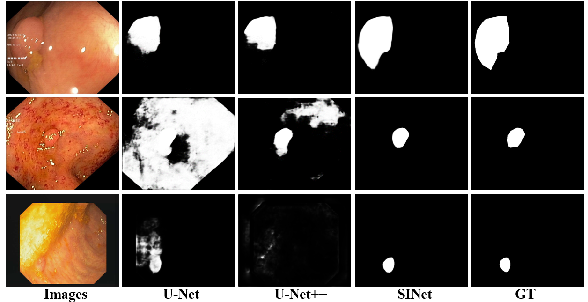

# SINet (CVPR2020)
Search and Identification Net (SINet) for Camouflaged Object Detection (code will be updated soon) 

## Task Relationship

Figure 1: Task relationship. One of the most popular directions in computer vision is generic object detection. Note that generic objects can be either salient or camouflaged; camouflaged objects can be seen as difficult cases of generic objects. Typical generic object detection tasks include semantic segmentation and panoptic segmentation (see Fig. 2 b).

References of salient object detection (SOD) benchmark works 
[1] VSOD: Shifting More Attention to Video Salient Object Detection. CVPR, 2019.  
[2] RGB SOD: Salient Objects in Clutter: Bringing Salient Object Detection to the Foreground. ECCV, 2018. 
[3] RGB-D SOD: Rethinking RGB-D Salient Object Detection: Models, Datasets, and Large-Scale Benchmarks. TNNLS, 2020. 
[4] Co-SOD: Taking a Deeper Look at the Co-salient Object Detection. CVPR, 2020.

Figure 2: Given an input image (a), we present the ground-truth for (b) panoptic segmentation (which detects generic objects including stuff and things), (c) salient instance/object detection (which detects objects that grasp human attention), and (d) the proposed camouflaged object detection task, where the goal is to detect objects that have a similar pattern (e.g., edge, texture, or color) to the natural habitat. In this case, the boundaries of the two butterflies are blended with the bananas, making them difficult to identify. This task is far more challenging than the traditional salient object detection or generic object detection.  

## Results

Figure 3: Qualitative results of our SINet and two top-performing baselines on COD10K. Refer to our paper for details.

Table 1: Quantitative results on different datasets. The best scores are highlighted in bold. See Section 5.1 for training details: (i) CPD1K,
(ii) CAMO, (iii) COD10K, (iv) CPD1K + CAMO + COD10K. Note that the ANet-SRM model (only trained on CAMO) does not have a publicly available code, thus other results are not available. $E_\phi$ denotes mean Emeasure. Baseline models are trained using the training setting (iv). 

Table 2: Quantitative results of Structure-measure (Sα) for each sub-class in our COD10K dataset-(1/2). The best
score of each category is highlighted in bold.  

Table 3: Quantitative results of Structure-measure (Sα) for each sub-class in our COD10K dataset-(2/2). The best
score of each category is highlighted in bold.  

Results of our SINet on four datasets (e.g., CHAMELEON[1], CPD1K-Test[2], CAMO-Test[3], and COD10K-Test[4]) can be found:  

https://drive.google.com/open?id=1fHAwcUwCjBKSw8eJ9OaQ9_0kW6VtDZ6L

Performance of competing methods can be found:

https://drive.google.com/open?id=1jGE_6IzjGw1ExqxteJ0KZSkM4GaEVC4J

References of datasets 
[1] Animal camouflage analysis: Chameleon database. Unpublished Manuscript, 2018.  
[2] Detection of people with camouflage pattern via dense deconvolution network. IEEE SPL, 2018. 
[3] Anabranch network for camouflaged object segmentation. CVIU, 2019. 
[4] Camouflaged Object Detection, CVPR, 2020.

## The Proposed COD10K Datasets

Figure 4: The extraction of individual samples including 29 sub-classes from our COD10K (1/5)–Terrestrial animals. 

Figure 5: Annotation diversity and meticulousness in the proposed COD10K dataset. Instead of only providing coarsegrained object-level annotations with the three major types of bias (e.g., Watermark embedded, Coarse annotation, and Occlusion) in prior works, we offer six different annotations, which include edge-level (4rd row), object-level (5rd row), instance-level (6rd row), bounding boxes (7rd row), and attributes (8rd row). Refer to the manuscript for attribute details. 

Figure 6: Regularized quality control during our labeling reverification stage. Strictly adheres to the four major criteria of rejection or acceptance to near the ceiling of annotation accuracy. 

## Training and Testing Sets
Our training dataset is:

https://drive.google.com/open?id=1aH9_0w3zCVoh9ttrU10xjCYcjuvPuzWY

Our testing dataset is:

https://drive.google.com/open?id=1AeJBD-FemHSVdprC8_6BOi41Wt5KgMIt

## Applications
1. Medical (polyp segmentation)

2. Agriculture (locust detection to prevent invasion)
3. Art (e.g., for photorealistic blending, or recreational art)
4. Military (for discriminating enemies)

5. Computer Vision (e.g., for search-and-rescue work, or rare species discovery)

## Paper

http://dpfan.net/wp-content/uploads/COD_CVPR20-OmittedModel.pdf

## Citation
Please cite our paper if you find the work useful: 

	@inproceedings{fan2020Camouflage,
  	title={Camouflaged Object Detection},
  	author={Fan, Deng-Ping and Ji, Ge-Peng and Sun, Guolei and Cheng, Ming-Ming and Shen, Jianbing and Shao, Ling},
  	booktitle={IEEE Conference on Computer Vision and Pattern Recognition (CVPR)},
  	year={2020}
	}
  
