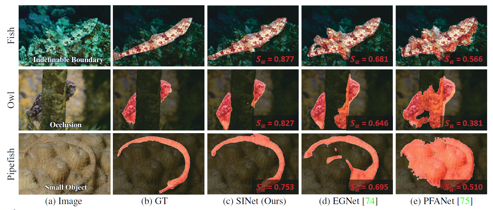

# SINet (CVPR2020)
Search and Identification Net (SINet) for Camouflaged Object Detection (code will be updated soon) 

Figure 1: Given an input image (a), we present the ground-truth for (b) panoptic segmentation (which detects generic objects including stuff and things), (c) salient instance/object detection (which detects objects that grasp human attention), and (d) the proposed camouflaged object detection task, where the goal is to detect objects that have a similar pattern (e.g., edge, texture, or color) to the natural habitat. In this case, the boundaries of the two butterflies are blended with the bananas, making them difficult to identify. This task is far more challenging than the traditional salient object detection or generic object detection.  

Figure 2: Qualitative results of our SINet and two top-performing baselines on COD10K. Refer to our paper for details.

Results of our SINet on four datasets (e.g., CHAMELEON[1], CPD1K-Test[2], CAMO-Test[3], and COD10K-Test[4]) can be found:  

https://drive.google.com/open?id=1fHAwcUwCjBKSw8eJ9OaQ9_0kW6VtDZ6L

Performance of competing methods can be found:

https://drive.google.com/open?id=1jGE_6IzjGw1ExqxteJ0KZSkM4GaEVC4J

References of datasets 
[1] Animal camouflage analysis: Chameleon database. Unpublished Manuscript, 2018.  
[2] Detection of people with camouflage pattern via dense deconvolution network. IEEE SPL, 2018. 
[3] Anabranch network for camouflaged object segmentation. CVIU, 2019. 
[4] Camouflaged Object Detection, CVPR, 2020.

Our training dataset is:

Our testing dataset is:

Please cite our paper if necessary: 
@inproceedings{fan2020Camouflage,
  title={Camouflaged Object Detection},
  author={Fan, Deng-Ping and Ji, Ge-Peng and Sun, Guolei and Cheng, Ming-Ming and Shen, Jianbing and Shao, Ling},
  booktitle={Proceedings of the IEEE conference on computer vision and pattern recognition},
  year={2020}
}
